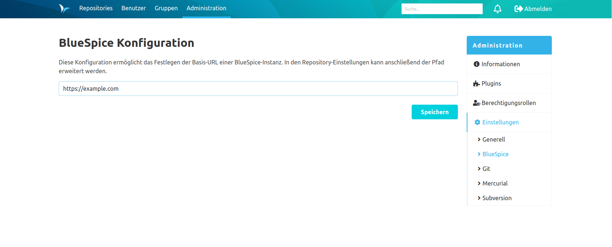
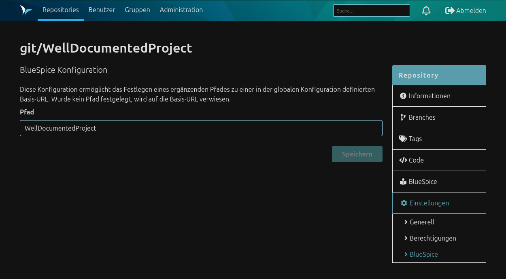

Das BlueSpice-Plugin enthält zwei Konfigurationen.

Die globale Konfiguration ermöglicht das Festlegen der Basis-URL einer BlueSpice-Instanz.

Die repository-spezifische Konfiguration ermöglicht das Festlegen eines ergänzenden Pfades zu einer definierten Basis-URL.
Wurde kein Pfad festgelegt, wird auf die Basis-URL verwiesen.

