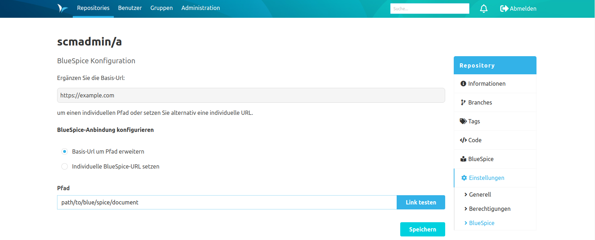

Das BlueSpice-Plugin enthält zwei Konfigurationen.

Die globale Konfiguration ermöglicht das Festlegen der Basis-URL einer BlueSpice-Instanz.

Die Repository spezifische Konfiguration ermöglicht das Festlegen eines ergänzenden Pfades zu einer definierten Basis-URL.
Wurde kein Pfad festgelegt, wird auf die Basis-URL verwiesen.
Außerdem besteht die Möglichkeit einen eigenen Pfad unabhängig von der Basis-URL fest zu legen.
Neben dem Input-Feld ist es möglich mit einem Button den aktuellen Link zu testen.

Wenn keine Basis-URL definiert ist, ist es möglich eine Repository spezifische URL zu bestimmen.

