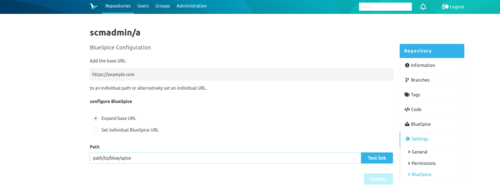

The BlueSpice plugin comes with two configurations.

The global configuration allows you to define the base URL of a BlueSpice instance. 

The repository-specific configuration allows you to define a supplementary path to a base URL. 
If no path has been defined, the base URL is referenced.

It is now possible to override the base url and use a complete url pointing to a blue spice page.

In addition to the input field, it is possible to test the current link with a button.

If you have no base URL defined you will be able to determine your own URL.

